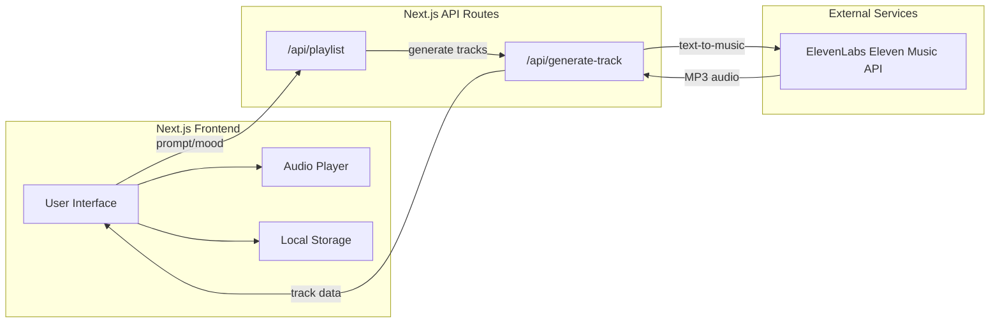

# AI Playlist Generator with ElevenLabs Eleven Music

## Architecture Overview



## Tech Stack

- **Framework**: Next.js 16+ (App Router) - use the CLI pnpm create next-app@latest my-app --yes
- **Styling**: Tailwind CSS
- **Audio Generation**: ElevenLabs Eleven Music API
- **State Management**: React hooks + Context
- **Persistence**: Browser localStorage
- **Audio Playback**: Custom HTML5 audio player

## Key Features

1. **Playlist Generation Input**
   - Free-form text prompt (e.g., "energetic workout music with electronic beats")
   - Predefined mood/genre selectors (chill, energetic, melancholic, etc.)
   - Track count selector (3-5 tracks)

2. **AI Music Generation**
   - Use ElevenLabs Eleven Music API to generate each track
   - Support for instrumental or vocal tracks
   - Configurable duration per track (30s - 2min recommended for playlist flow)

3. **Playlist Player**
   - Built-in audio player with play/pause, skip, progress bar
   - Track listing with current track highlight
   - Download individual tracks or full playlist

4. **Local Persistence**
   - Save generated playlists to localStorage
   - Browse and replay saved playlists

## Project Structure

```
ai-playlist/
├── app/
│   ├── page.tsx              # Main playlist generator UI
│   ├── layout.tsx            # Root layout
│   ├── globals.css           # Global styles
│   └── api/
│       ├── generate-playlist/route.ts  # Orchestrates playlist creation
│       └── generate-track/route.ts     # Calls ElevenLabs API
├── components/
│   ├── PlaylistForm.tsx      # Input form (prompt + mood selectors)
│   ├── PlaylistPlayer.tsx    # Audio player component
│   ├── TrackList.tsx         # List of generated tracks
│   └── SavedPlaylists.tsx    # Saved playlists browser
├── lib/
│   ├── elevenlabs.ts         # ElevenLabs API client
│   └── storage.ts            # localStorage utilities
├── types/
│   └── index.ts              # TypeScript types
└── .env.local                # API keys (ELEVENLABS_API_KEY)
```

## ElevenLabs Integration

Based on the [Eleven Music documentation](https://elevenlabs.io/docs/overview/capabilities/music), the API accepts:
- Natural language prompts describing genre, mood, style
- Optional lyrics
- Duration (10s - 5min)
- Instrumental-only flag

Example prompt construction:
```typescript
const prompt = `Create a ${mood} ${genre} track, ${duration} seconds, 
  instrumental only. ${userDescription}`;
```

## UI Design Direction

- Dark theme with vibrant accent colors (music/audio aesthetic)
- Waveform visualizations for tracks
- Smooth animations for generation progress
- Mobile-responsive layout

## Implementation Steps

1. Initialize Next.js project with TypeScript and Tailwind
2. Set up ElevenLabs API integration
3. Build the playlist generation form UI
4. Implement track generation API routes
5. Create the audio player component
6. Add localStorage persistence for playlists
7. Polish UI with animations and final styling

## Implementation Todos

- [ ] Initialize Next.js project with TypeScript, Tailwind CSS, and project structure
- [ ] Create ElevenLabs API client and generate-track API route
- [ ] Build PlaylistForm component with prompt input and mood/genre selectors
- [ ] Implement playlist generation API that orchestrates multiple track generations
- [ ] Create PlaylistPlayer component with full playback controls
- [ ] Connect form, API, and player into complete generation flow
- [ ] Add localStorage persistence and saved playlists browser
- [ ] Final UI polish - animations, loading states, responsive design


## Links

- Design reference via Figma MCP: https://www.figma.com/design/juJhmoPLNaDfC3VDOAvszG/UChicago---Vibe-Coding-Workshop-2?node-id=1-731&t=ZOVLSGr1WutheLWR-11


### Elven labs

- API: https://elevenlabs.io/docs/overview/capabilities/music
- API REF - compose: https://elevenlabs.io/docs/api-reference/music/compose
- API REF - stream: https://elevenlabs.io/docs/api-reference/music/stream
- API REF - composeDetailed: https://elevenlabs.io/docs/api-reference/music/compose-detailed
- API REF - composePlan: https://elevenlabs.io/docs/api-reference/music/create-composition-plan


### Database

- Get started: https://supabase.com/docs/guides/getting-started/quickstarts/nextjs
- Auth: https://supabase.com/docs/guides/auth/quickstarts/nextjs


### additional

- front-end skill: /Font-end-skill.md


## Gemini


- APIP DOCS: https://aistudio.google.com/welcome?utm_source=google&utm_source=google&utm_medium=cpc&utm_medium=cpc&utm_campaign=FY25-global-DR-gsem-BKWS-1710442&utm_campaign=Cloud-SS-DR-AIS-FY26-global-gsem-1713578&utm_content=text-ad-none-any-DEV_c-CRE_726057516165-ADGP_Hybrid%20%7C%20BKWS%20-%20EXA%20%7C%20Txt-Gemini-Gemini%20API%20Docs-KWID_2306777471036-kwd-2306777471036&utm_content=text-ad&utm_term=KW_gemini%20api%20docs-ST_gemini%20api%20docs&utm_term=KW_gemini%20api%20docs&gad_source=1&gad_campaignid=20866959509&gbraid=0AAAAACn9t66hlGBnHBbtRxzR6FY-YJL3v&gclid=Cj0KCQiA1JLLBhCDARIsAAVfy7jaai6SXR9SQDtVuBoq3-SyUopqLnBHIuAdR2vdpQVqp6KYLgP0PaoaAi6dEALw_wcB